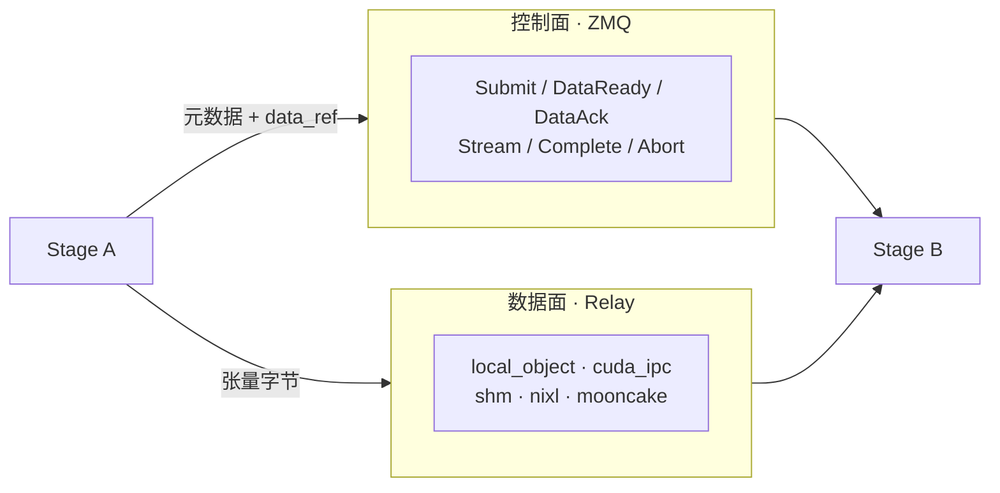

# SGLang-Omni 中文导读

> 这是一份**为读代码的人写的**中文说明，不是官方 README 的翻译。官方英文说明见 [README.md](./README.md)，深入笔记见 [notes/](./notes/)。

---

## 一、这个项目解决什么问题

文本大模型的推理拓扑是一条直线：分词 → prefill → decode → 反分词。整条链路只有一种计算模式，一个调度器就能管完，这也是 [SGLang](https://github.com/sgl-project/sglang) 的战场。

但一次 omni 模型的语音对话不是直线：

```
音视频输入 ─→ preprocessing ─┬─→ image_encoder ─┐
                             └─→ audio_encoder ─┤
                                                ├─→ thinker (自回归) ─→ decode ─→ 文本
                                                │         │
                                                │         └─ 流式 hidden states
                                                │              ↓
                                                └────→ talker_ar (自回归) ─→ code2wav (声码器) ─→ 音频
```

这七段的计算特征完全不同：

| 阶段 | 特征 | 需要什么 |
| --- | --- | --- |
| preprocessing | CPU 密集 + 重 IO | 线程池，不占 GPU |
| encoder | 单次前向，可批 | GPU，无 KV cache |
| thinker / talker | 自回归，长程状态 | KV cache、连续批处理、CUDA graph |
| code2wav | 流式逐块解码 | GPU + per-request 累积状态 |
| decode | 纯字符串处理 | 什么都不需要 |

塞进一个进程会互相拖累：CPU 上的音频解码阻塞 GPU decode 循环，声码器的显存要和 KV cache 抢池子。

**SGLang-Omni 的答案是：每个阶段独立成进程、配自己的调度器，阶段之间用显式的控制面 + 数据面通信。** 它拥有流水线拓扑、阶段生命周期、阶段间传输、模型接入层和 OpenAI 兼容服务面；自回归那一段的调度与执行仍然交给 SGLang。

---

## 二、功能

### 服务能力

- **OpenAI 兼容 API**
  - `POST /v1/chat/completions` —— 多模态对话，支持流式与音频输出
  - `POST /v1/audio/speech` `/speech/batch` —— TTS，支持批量
  - `WS /v1/audio/speech/stream` —— 流式 TTS
  - `POST /v1/audio/transcriptions` `/translations` —— ASR 与翻译
  - `WS /v1/realtime` —— OpenAI Realtime API
  - `GET/POST/DELETE /v1/audio/voices` —— 上传音色管理
- **运维与 RL 控制面** —— `pause_generation`、`update_weights_from_disk`、`update_weights_from_distributed`、`weights_checker`（用于 RLHF rollout 场景的权重热更新）
- **性能剖析** —— `start_profile` / `stop_profile`，torch trace + 请求级事件 JSONL，`python -m sglang_omni.profiler <dir>` 出 timeline / stage / hop 报表

### 运行时能力

- **多阶段编排** —— 预处理、编码器、自回归引擎、talker、解码器、声码器、聚合器
- **按阶段选调度器** —— AR 阶段用 `OmniScheduler`（复用 SGLang），非 AR 用 `SimpleScheduler` 系列
- **五种传输后端** —— 同进程对象直传 / CUDA IPC / 共享内存 / NIXL / Mooncake，按边自动选择
- **张量并行 + 阶段副本** —— 单阶段 TP，或同一逻辑阶段起多个副本
- **GPU 共置** —— 多个阶段共用一张卡，配合 NVIDIA MPS 分时
- **多 worker 前门** —— `sglang_omni_router/`，健康检查、就绪探测、生命周期、能力发现

### 支持的模型（20 个）

| 类别 | 模型 |
| --- | --- |
| Omni 对话 | Qwen3-Omni、Ming-Omni |
| TTS | Qwen3-TTS、MOSS-TTS、MOSS-TTS-Local、Higgs Audio v3、Fish Speech S2-Pro、dots.tts、ZONOS2、Voxtral-TTS、Ming-TTS、AudAR-TTS、Fun-CosyVoice3 |
| ASR | Qwen3-ASR、Fun-ASR、ARK-ASR、Whisper、MOSS-Transcribe-Diarize（带说话人分离） |
| 音乐生成 | MiniMax Music 3 |
| 扩散 LLM | LLaDA2-Uni（4 阶段，走 `DllmScheduler`） |

---

## 三、技术栈

| 层 | 选型 |
| --- | --- |
| 语言 | Python 3.10–3.12（约 14.5 万行 / 526 文件）+ Rust（Router） |
| 深度学习 | PyTorch 2.13（Linux）/ 2.11（Apple arm64），transformers 5.12.1 |
| AR 推理内核 | SGLang 0.5.18（**组合**进来，非继承） |
| 控制面 | ZeroMQ（PUSH/PULL + PUB/SUB）+ msgpack / msgspec |
| 数据面 | shm / cuda_ipc / nccl / nixl / mooncake |
| 进程模型 | `multiprocessing` spawn |
| 配置 | Pydantic 声明式（`PipelineConfig` / `StageConfig`） |
| HTTP | FastAPI + Uvicorn |
| CLI | Typer |
| 硬件 | CUDA（完整）；ROCm / Intel XPU / 昇腾 NPU / Apple Silicon（实验性） |

---

## 四、架构

### 4.1 请求的纵向路径

```
HTTP 请求
  │
  ▼  serve/openai_api.py         协议层：OpenAI schema → GenerateRequest
  ▼  client/client.py            客户端层：GenerateRequest → OmniRequest，结果聚合
  ▼  pipeline/coordinator.py     协调器：投递入口阶段，追踪状态，收集终态
  ▼  pipeline/stage/runtime.py   Stage：IO 壳，控制消息 / relay 读写 / 扇入 / 流式路由
  ▼  scheduling/*.py             Scheduler：每阶段一个执行循环
  ▼  model_runner/*.py           ModelRunner：ForwardBatch + 前向 + 采样
  ▼  模型 forward
```

### 4.2 阶段之间的横向路径



**核心设计：控制面只传引用，数据面才传张量。** `DataReadyMessage.data_ref` 里是「对象 id + 传输方式 + 张量布局 + 后端元数据」，几百 MB 的 hidden states 走另一条路。这让 ZMQ 不会被大张量堵死，也让传输后端能按边独立替换。

传输方式是**推导出来的，不是配出来的**（`comm/router.py`）：

| 传输 | 触发条件 |
| --- | --- |
| `local_object` | 同一个 OS 进程 |
| direct CUDA IPC | 同 placement、不同进程、CUDA ordinal 兼容 |
| `cuda_ipc`（池化） | 同节点 GPU 边，不满足直传 |
| `shm` | 同节点、非 GPU-to-GPU |
| `mooncake` | 跨节点 |

### 4.3 配置到运行时

```
models/<model>/config.py    声明 stages（谁存在、谁连谁、跑哪张卡）
        ↓ registry.py        按 HF architectures[0] 找到 EntryClass
        ↓ config/            合并：默认值 < YAML < shared < 广播 flag < 点号 flag
        ↓ config/topology.py 编译成逻辑进程计划
        ↓ pipeline/mp_runner spawn 进程 → wait_ready → 注册到 Coordinator
        ↓ 运行
```

**硬约束：拓扑只在模型的 `config.py` 里定义。** YAML 和 CLI 只能覆盖已有 stage 的设置，永远不能增删 stage。

---

## 五、目录说明

```
sglang_omni/
├── proto/          消息契约（先读这个，全系统的词汇表）        0.8k
├── pipeline/       Coordinator / Stage / 进程编排              6.1k
│   ├── coordinator.py      全局请求路由与状态机
│   ├── stage/runtime.py    Stage —— 最重的一个类
│   ├── mp_runner.py        启动编排总入口
│   └── stage_workers.py    进程 spawn 与 stage 构造
├── scheduling/     六种调度器 + SGLang 桥接                    8.2k
│   ├── omni_scheduler.py   AR 阶段，组合 SGLang
│   ├── simple_scheduler.py 非 AR 阶段
│   └── streaming_*.py      流式阶段
├── model_runner/   AR 前向路径（ForwardBatch → 采样 → 输出）   3.6k
├── comm/           传输选择 + 打包拆包                          2.7k
├── relay/          五种传输后端                                 3.1k
├── config/         声明式配置、点号路径、拓扑编译               4.0k
├── serve/          FastAPI 路由、OpenAI 协议                    8.8k
├── client/         请求转换 + 结果聚合                          1.4k
├── models/         20 个模型的接入代码                          95k  ← 占 66%
├── platforms/      七个硬件后端的差异隔离                       0.8k
├── mps/            NVIDIA Multi-Process Service 管理           2.0k
├── profiler/       torch trace + 请求级事件                     1.2k
├── preprocessing/  音/视频/图像/文本规范化                      2.0k
└── cli/            sgl-omni serve / config / check-gpu         0.9k

sglang_omni_router/  多 worker 前门（Rust + Python）
benchmarks/          16 个基准脚本 + 数据集与指标
examples/configs/    25+ 个可直接 --config 的 YAML
tests/               369 个测试文件，主 lane 无 GPU
```

**模型目录约定**：

```
models/<name>/
├── config.py            PipelineConfig 子类 + stages + EntryClass（必须）
├── stages.py            StageConfig.factory_path 指向的工厂
├── request_builders.py  阶段间 payload 变换、路由、扇入合并
├── payload_types.py     模型专属的类型化状态
├── sglang_model.py      SGLang 侧模型类
└── components/          模型模块、processor、vocoder
```

`registry.py` 遍历 `models/` 的每个子包取 `EntryClass`，按 `architecture` 匹配 HF 配置。**没有手写清单要维护**——加模型就是加一个目录。

---

## 六、核心流程

### 6.1 启动

```
launch_server()
  ① _find_available_port        端口先占，别加载完权重才发现被占
  ② prepare_pipeline_runtime    解析 placement / process plan / endpoints
  ③ Coordinator.start()         协调器先起来收消息
  ④ MPS daemon（若开启）        必须早于第一次 CUDA init
  ⑤ group.spawn(ctx)            spawn 出所有 stage 进程
  ⑥ wait_ready(timeout=600)     等全部就绪
  ⑦ register_stage()            就绪后才注册，避免请求打到没加载完的进程
  ⑧ Client → create_app → uvicorn
```

### 6.2 一次请求

```
ChatCompletionRequest
  → _build_chat_generate_request()   唯一的协议翻译点
  → GenerateRequest → Client → OmniRequest
  → Coordinator.submit() → SubmitMessage → entry stage
  → 阶段间自主跳转（Coordinator 不参与）
  → 终态阶段 CompleteMessage → Coordinator 合并
  → Client 聚合文本 + 音频 + usage → OpenAI JSON / SSE
```

### 6.3 阶段间一跳（relay 路径）

```
发送方：write_payload() 抽出张量 → 拼成一个 uint8 buffer
      → relay.put_async(buffer)
      → 发 DataReadyMessage(data_ref)      ← 先发控制消息
      → await put 完成                      ← 再等传输
接收方：收到 → relay.get_async() → 还原张量 → 扇入判定 → scheduler.inbox
      → 回 DataAckMessage
发送方：收到 ACK → 释放 slot
```

**「控制先发、再等完成」的顺序不能反。** NIXL 这类基于 credit 的后端，接收方不开始读就不会释放发送方的 credit；发送方先等，就永远等不到。

### 6.4 流式

`stream_to` 声明的边上，上游边算边发块。两个非直觉点：

- **小块内联**：CPU 张量序列化后 ≤ 16 KiB 且 metadata 无张量时，直接搭 `DataReadyMessage` 顺风车，不需要 ACK
- **`can_accept_stream_before_payload`**：流块可能比完整 payload 先到（上游还在解码，携带上下文的 payload 要等它跑完），所以下游必须能先开流后补上下文

更详细的流程与图见 [notes/core_flows.md](./notes/core_flows.md)。

---

## 七、如何运行

### 7.1 Docker（NVIDIA CUDA，推荐）

```bash
docker pull hongccc/sglang-omni:dev
```

```bash
docker run -it --shm-size 32g --gpus all --ipc host --network host --privileged hongccc/sglang-omni:dev /bin/zsh
```

容器内：

```bash
pip install --upgrade pip && pip install uv && uv venv .venv -p 3.12 && source .venv/bin/activate && uv pip install --prerelease=allow "sglang-omni==0.1.4"
```

### 7.2 Apple Silicon（源码，实验性）

```bash
./install.sh && source .venv-apple/bin/activate
```

脚本是幂等的：装 Homebrew 的 `ffmpeg@7` 和 `uv`，从源码装 SGLang v0.5.18 的 `all_mps` extra，再 editable 装当前 checkout。

**三个坑**：

- `ffmpeg@7` 不能换成不带版本的 `ffmpeg`（那是 FFmpeg 9，而 torchcodec 0.11.1 只支持 4–8）
- `ffmpeg@7` 是 keg-only，要手动导 `DYLD_LIBRARY_PATH`；且 macOS SIP 会在启动受保护的系统可执行文件时剥掉 `DYLD_*`，所以要设在最终的 `sgl-omni` 进程上
- Apple 分支的依赖 pin 和 Linux 不同（torch 2.11.0、torchcodec 0.11.1、装 mlx 而非 sglang wheel），`dots.tts` 和 `nemo_text_processing` 因为 Pynini/OpenFst 没有 arm64 wheel 被跳过

### 7.3 启动服务

```bash
sgl-omni serve --model-path Qwen/Qwen3-ASR-1.7B --model-name Qwen/Qwen3-ASR-1.7B --port 8000
```

用现成的 YAML：

```bash
sgl-omni serve --config examples/configs/qwen3_omni_colocated_h100_bf16.yaml --port 8000
```

Apple Silicon + MLX：

```bash
SGLANG_USE_MLX=1 sgl-omni serve --model-path mlx-community/Qwen3-ASR-0.6B-4bit --model-name Qwen/Qwen3-ASR-0.6B --asr.engine.max_running_requests 1 --port 8000
```

### 7.4 调配置

按阶段覆盖用点号路径，路径起点就是阶段名：

```bash
sgl-omni serve --config omni.yaml --tts_engine.tp_size 2 --tts_engine.engine.mem_fraction_static 0.7 --vocoder.factory.dtype bfloat16
```

三个消费者组：stage 顶层（`gpu` `tp_size` `process`）→ 父进程；`engine.*` → SGLang `ServerArgs`；`factory.*` → 工厂函数签名。**未声明的 key 原样透传，由消费方裁决。**

看合并结果和溯源：

```bash
sgl-omni config resolve --config omni.yaml --show provenance
```

```bash
sgl-omni config explain stages.tts_engine.engine.mem_fraction_static
```

### 7.5 调用

```bash
curl -X POST http://localhost:8000/v1/audio/transcriptions -F model=Qwen/Qwen3-ASR-1.7B -F file=@tests/data/query_to_cars.wav -F response_format=json
```

---

## 八、如何测试

### 无 GPU 的主单测 lane

CI 的默认单测 job 是**显式关掉 CUDA** 的，需要加速器的测试被隔离到另一个 job：

```bash
CUDA_VISIBLE_DEVICES="" pytest tests/ -v -m "not benchmark and not accelerator"
```

`tests/unit_test/` 下 40 多个子目录用 `fixtures/{pipeline,qwen,fish}_fakes.py` 替掉模型前向，所以 `pipeline/` `scheduling/` `config/` `comm/` `serve/` 这几层都是 CPU 可验证的。

### 测试文件布局约束

`test-layout.yaml` 强制所有 `.py` 测试落在四个 lane 之一：

```
tests/unit_test/    单元测试（默认 CPU）
tests/test_model/   模型端到端（需 GPU）
tests/test_ci/      CI 基础设施自测
tests/utils/        共享工具
```

### 提 PR 前

```bash
pre-commit install && pre-commit run --all-files
```

**CI 需要 maintainer 打 `run-ci` 标签才会跑**（自建 GPU 机器）。标签打上后每次 push 都会重跑。用斜杠命令选测试模型，TTS 和 ASR 各选一个可组合：

```
/tag-and-rerun-ci moss fun-asr
```

Draft PR 一律跳过，所以别把 PR 留在 draft 状态等 CI。

### 文档与 Router（无 GPU）

```bash
cd docs && pip install -r requirements.txt && make html
```

```bash
cd sglang_omni_router/rust && cargo test
```

（`make compile` 会真执行 notebook，本地预览用 `bash serve.sh` 即可。）

---

## 九、扩展方向

### 加一个新模型

1. 取 HF `config.json::architectures[0]`
2. 建 `sglang_omni/models/<name>/`，写 `config.py`：`PipelineConfig` 子类设 `architecture` ClassVar，导出 `EntryClass`
3. HF 配置不在 stock transformers 里的话，import 时 `AutoConfig.register(...)`
4. 写 `sglang_model.py`，在 `model_runner/sglang_model_runner.py::_register_omni_model` 加一行
5. 在 `stages.py` 实现三个工厂；AR 工厂用 `build_sglang_server_args` + `create_sglang_infrastructure`，返回 `OmniScheduler`
6. 写 `request_builders.py` 和 `payload_types.py`，把 abort 清理接到每个碰共享状态的调度器上
7. 加 `examples/configs/<name>.yaml`，在 `docs/basic_usage/tts.md` 列出来
8. 补无 GPU 单测

最小可用的 TTS 流水线是三阶段：`preprocessing` → `tts_engine`（`OmniScheduler`）→ `vocoder`（`SimpleScheduler` + `batch_compute_fn`）。要流式就在引擎上设 `stream_to=["vocoder"]`、在声码器上设 `can_accept_stream_before_payload=True`。

完整清单见 `docs/developer_reference/tts_model_integration.md`。

### 加一个新传输后端

实现 `relay/base.py` 的四个方法，用 `@register_relay("name")` 注册：

```python
async def put_async(tensor, request_id=None, dst_rank=None) -> RelayOperation
async def get_async(metadata, dest_tensor, request_id=None) -> RelayOperation
def cleanup(request_id): ...
def close(): ...
```

格式是后端中立的——只需要搬一个扁平张量缓冲区，返回一段另一端能用来 `get` 的元数据。

### 值得做的方向

| 方向 | 现状 |
| --- | --- |
| 非 CUDA 后端 | `platforms/` 只有 754 行覆盖七个后端；Apple 路径只有 Qwen3-ASR 端到端可用，且限制多 |
| Rust Router | 刚立地基，76 KB，是全项目唯一读得完的模块 |
| 模型接入层抽象 | 19 份 `stages.py`，`request_builders.py` 从 117 到 1398 行不等 |
| 硬编码性能常数 | 如 encoder 的 `max_batch_wait_ms=50`，见 [#1147](https://github.com/sgl-project/sglang-omni/issues/1147) |
| 单类过重 | `omni_scheduler.py` 2677 行、`stage/runtime.py` 1843 行 |

详见 [notes/learning_summary.md](./notes/learning_summary.md) 第四节。

---

## 十、延伸阅读

| 文档 | 内容 |
| --- | --- |
| [notes/architecture.md](./notes/architecture.md) | 整体架构与技术栈 |
| [notes/modules.md](./notes/modules.md) | 模块拆分与职责 |
| [notes/core_flows.md](./notes/core_flows.md) | 四条核心流程 + 读代码路线 |
| [notes/code_insights.md](./notes/code_insights.md) | 十处核心代码带注释讲解 |
| [notes/learning_summary.md](./notes/learning_summary.md) | 设计思路、可借鉴点、优化点 |
| `docs/developer_reference/main.md` | 官方架构总览 |
| `docs/developer_reference/pipeline.md` | Coordinator / Stage / Scheduler 契约 |
| `docs/developer_reference/communication.md` | 控制面与数据面协议 |
| `docs/developer_reference/config.md` | 配置合并规则 |
| `docs/developer_reference/tts_model_integration.md` | 加 TTS 模型的完整清单 |
