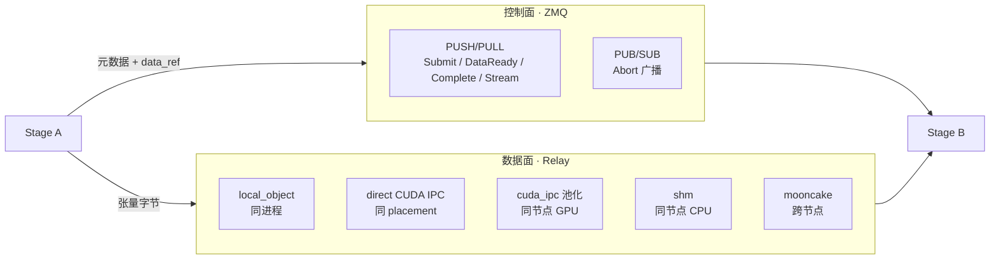

# 01 · 整体架构与技术栈

> 阅读顺序：本篇 → [modules.md](./modules.md) → [core_flows.md](./core_flows.md) → [code_insights.md](./code_insights.md) → [learning_summary.md](./learning_summary.md)

## 一、这是个什么项目

SGLang-Omni 是 **omni / 语音 / TTS 模型的多阶段推理服务运行时**。

一句话讲清它和 SGLang 的关系：

- **SGLang** 解决的是「一个自回归循环怎么跑得快」——KV cache、radix tree、连续批处理、CUDA graph。
- **SGLang-Omni** 解决的是「一次生成被拆成好几段异构计算时，怎么把它们编排起来」。

这个区别是整个项目所有设计的源头。文本 LLM 的推理拓扑是一条直线：tokenize → prefill → decode → detokenize。而一次 Qwen3-Omni 的语音对话是这样的：

```
音视频输入 → preprocessing → image_encoder ─┐
                          → audio_encoder ─┼→ thinker(AR) → decode(文本输出)
                                            │        ↓ 流式 hidden states
                                            └────→ talker_ar(AR) → code2wav(声码器) → 音频输出
```

七个阶段，计算模式完全不同：

| 阶段 | 计算特征 | 需要什么 |
| --- | --- | --- |
| preprocessing | CPU 密集，重 IO（下载/解码音视频） | 线程池，不占 GPU |
| image/audio_encoder | 单次前向，可批 | GPU，无 KV cache |
| thinker / talker_ar | 自回归，长程状态 | KV cache、连续批处理、CUDA graph |
| code2wav (vocoder) | 流式逐块解码 | GPU，per-request 累积状态 |
| decode | 纯 CPU 字符串处理 | 什么都不需要 |

把它们塞进一个进程、一套调度器，就会互相拖累：CPU 上的音频解码会阻塞 GPU 的 decode 循环；声码器占的那点显存要和 KV cache 抢池子。**SGLang-Omni 的核心主张就是：每个阶段独立成进程、配自己的调度器，阶段之间靠显式的控制面 + 数据面通信。**

## 二、技术栈

| 层 | 选型 | 说明 |
| --- | --- | --- |
| 语言 | Python 3.10–3.12（主体）+ Rust（Router） | 主体约 14.5 万行 / 526 个文件 |
| 深度学习 | PyTorch 2.13（Linux）/ 2.11（Apple arm64）、transformers 5.12.1 | Apple 分支还装 mlx / mlx-lm |
| AR 推理内核 | SGLang 0.5.18 | 被「组合」进来，不是继承 |
| 控制面 | ZeroMQ（PUSH/PULL + PUB/SUB）+ msgpack / msgspec | 只传元数据 |
| 数据面 | 5 种 relay 后端：shm / cuda_ipc / nccl / nixl / mooncake | 传张量 |
| 进程模型 | `multiprocessing` spawn 上下文 | 每个 stage 一个或多个 OS 进程 |
| 配置 | Pydantic（`PipelineConfig` / `StageConfig`） | 声明式拓扑 |
| HTTP | FastAPI + Uvicorn，OpenAI 兼容 | `/v1/chat/completions`、`/v1/audio/speech`、`/v1/audio/transcriptions`、`/v1/realtime` |
| CLI | Typer（`sgl-omni serve` / `config` / `check-gpu`） | |
| 多机前门 | Rust（axum 系）+ Python supervisor | `sglang_omni_router/` |
| 测试 | pytest，369 个测试文件，主 lane 显式关掉 CUDA | 见 core_flows.md 第六节 |

**项目类型判定**：这是一个**后端服务 + 系统级基础设施项目**，不是库、不是应用。它的产出物是一个常驻的 HTTP 服务进程组。判断依据：`project.scripts` 只暴露 `sgl-omni` 和 `sgl-omni-router-py` 两个可执行入口，代码主体是进程编排、传输、调度，而不是可被 import 的 API。

## 三、三层视角

### 3.1 从上往下：请求怎么走

```
HTTP 请求
  ↓  serve/openai_api.py          协议层：OpenAI schema → GenerateRequest
  ↓  client/client.py             客户端层：GenerateRequest → OmniRequest，结果聚合
  ↓  pipeline/coordinator.py      协调器：投递到 entry stage，追踪状态，收集终态
  ↓  pipeline/stage/runtime.py    Stage：纯 IO 壳，收控制消息、读写 relay、扇入
  ↓  scheduling/*.py              Scheduler：每阶段一个执行循环
  ↓  model_runner/*.py            ModelRunner：ForwardBatch 构造 + 前向 + 采样
  ↓  模型 forward
```

这条链路在 `docs/developer_reference/main.md` 里被压缩成一行：

```text
HTTP API -> Client -> Coordinator -> Stage -> Scheduler -> ModelRunner -> model forward
```

### 3.2 从左往右：阶段之间怎么走



**这是整个项目最重要的一条设计线：控制面只传引用，数据面才传张量。** `DataReadyMessage.data_ref` 里装的是「对象 id + 传输方式 + 张量布局 + 后端专属元数据」，实际几百 MB 的 hidden states 走的是另一条路。这样 ZMQ 不会被大张量堵死，而传输后端可以按边（edge）独立换掉。

### 3.3 从静态到动态：配置怎么变成运行时

```
models/<model>/config.py      声明 stages 列表（谁存在、谁连谁、跑在哪张卡）
        ↓  registry.py         按 HF architectures[0] 找到 EntryClass
        ↓  config/ 合并层       YAML + CLI 点号路径 + shared 选择器 + 广播 flag
        ↓  config/topology.py   编译成 LogicalProcessPlan（逻辑进程 → 副本 → 设备）
        ↓  pipeline/mp_runner   spawn 出所有进程，等 ready，注册到 Coordinator
        ↓  运行
```

关键约束（写在 `docs/developer_reference/config.md` 里）：**拓扑只在模型的 `config.py` 里定义，YAML 和 CLI 只能覆盖已有 stage 的设置，永远不能增删 stage。** 这条规则把「哪些阶段存在」这件事钉死在代码里，让部署侧的配置永远不会改变系统的形状。

## 四、目录分类

| 分类 | 目录 | 行数量级 |
| --- | --- | --- |
| **core · 编排** | `pipeline/` | 6.1k |
| **core · 调度** | `scheduling/` | 8.2k |
| **core · 模型执行** | `model_runner/` | 3.6k |
| **infra · 通信** | `comm/` + `relay/` | 5.8k |
| **infra · 配置** | `config/` | 4.0k |
| **infra · 消息契约** | `proto/` | 0.8k |
| **api · 协议层** | `serve/` | 8.8k |
| **api · 客户端** | `client/` | 1.4k |
| **models · 模型接入** | `models/`（20 个模型） | 95k（占 66%） |
| **infra · 平台抽象** | `platforms/`（cuda/rocm/xpu/npu/musa/apple/cpu） | 0.8k |
| **infra · 可观测** | `profiler/`、`diagnostics/` | 1.6k |
| **infra · GPU 共享** | `mps/`（NVIDIA Multi-Process Service） | 2.0k |
| **utils** | `utils/`、`preprocessing/`、`vendor/`、`sampling/` | 5.6k |
| **cli** | `cli/` | 0.9k |
| **独立组件** | `sglang_omni_router/`（Rust + Python） | — |

**这张表最该记住的一行是 models 占 66%。** 框架本身只有约 4.8 万行，是读得完的；剩下三分之二是二十个模型各自的接入代码，按需读。

## 五、和 SGLang 的边界在哪

这是理解本项目最容易糊涂的地方。边界是：

| 归 SGLang-Omni | 归 SGLang |
| --- | --- |
| 流水线拓扑、阶段生命周期 | KV cache、radix tree |
| 阶段间传输（control plane + relay） | 批次选择（prefill/decode 混排） |
| 模型接入层（`models/<name>/`） | 模型前向执行、CUDA graph |
| OpenAI 兼容服务面 | 采样内核、量化内核 |
| 请求对象、流式语义 | `ServerArgs` 语义 |

具体到代码：`scheduling/omni_scheduler.py` 里的 `OmniScheduler` **不继承** SGLang 的 `Scheduler`，而是通过 `__getattr__` 把未定义的方法转发到上游类上再绑定到自己实例。细节见 [code_insights.md](./code_insights.md) 第一节——这是全项目最值得学的一个技巧。
