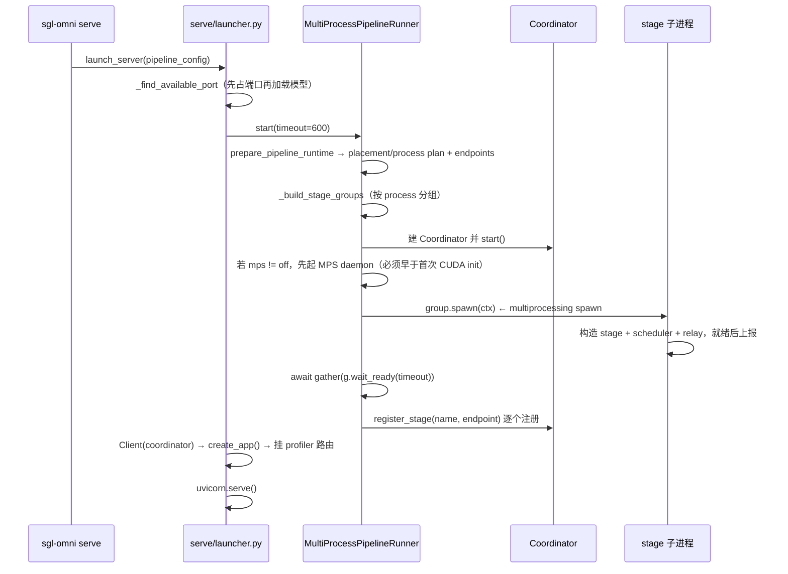
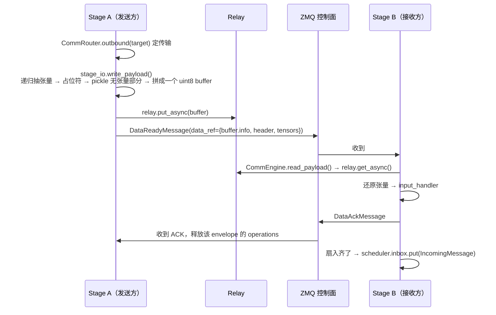
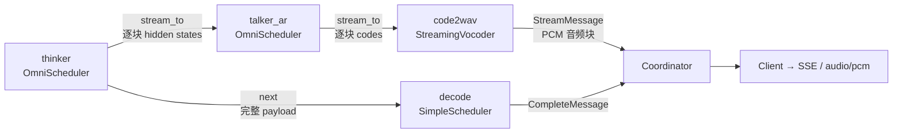

# 03 · 核心流程

四条主线：**启动 → 请求 → 流式 → 中止**。每条都给出「读哪个文件的哪一段」。

---

## 一、启动流程



**四个值得注意的顺序约束**（都写在代码注释里）：

1. **端口先占**（`_find_available_port` 在第 0 步）——避免加载完几十 GB 权重才发现端口被占。
2. **MPS daemon 必须早于第一次 CUDA init**，代码注释原文：*"daemons must predate the first CUDA init and ride the same spawn-time env patching"*。
3. **`register_stage` 在 `wait_ready` 之后**——Coordinator 只认已经就绪的 stage，避免请求打到还在加载权重的进程上。
4. **启动失败要先 cleanup 再 close MPS**，`mp_runner.start()` 的异常处理写了两层 `except`（`Exception` 和 `BaseException`），保证 Ctrl-C 也能把 MPS daemon 收干净。

要读的代码：`serve/launcher.py:368-460`（`_run_server`）→ `pipeline/mp_runner.py:489-600`（`start`）→ `pipeline/stage_workers.py:264-400`（`spawn` / `stage_process_main`）。

---

## 二、请求流程（非流式 chat）


**`_build_chat_generate_request()` 是唯一的协议翻译点**，它做七件事：规范化 stop 序列、构造 `SamplingParams`、把 chat messages 转成内部 `Message`、映射按阶段的采样覆盖、透传 `stage_params`、把媒体输入/音频配置/视频处理覆盖存进 metadata、把 `modalities` 抄成 `output_modalities`。

**Coordinator 只把请求投给 `entry_stage` 一次**，之后的阶段跳转由 Stage 自己按 `StageConfig.next` 决定，Coordinator 不参与。它只在两端出现：入口投递、终态收集。

---

## 三、阶段间的一跳（最值得画清楚的一段）

以 relay 支撑的普通载荷为例（`docs/developer_reference/communication.md` 的六步）：



`data_ref` 的三段内容：

- `buffer.info` — 后端专属元数据（来自 `RelayOperation.metadata`）
- `header` — base64 编码的、**抽掉张量之后**的 `StagePayload`
- `tensors` — 每个张量的 path / shape / dtype / offset / 字节数

**三条路径的 ACK 语义不同，这是最容易踩的地方**：

| 路径 | 有没有 relay ACK | 生命周期靠谁 |
| --- | --- | --- |
| `local_object` | 无 | Python 引用；接收方必须当只读，发送方不许改不许回收 |
| direct PyTorch CUDA IPC | **无** | PyTorch 的 CUDA IPC 所有权机制 |
| 池化 relay（cuda_ipc / shm / mooncake） | 有，一个逻辑 ACK 释放整段 slot | 发送方持有 operation 直到 ACK |

---

## 四、流式流程（thinker → talker → vocoder）

流式用在生产者-消费者边上：thinker 的 hidden states 喂给 talker，talker 的 code 张量喂给 vocoder。



三个非直觉的设计点：

**1. 「控制消息先发，再等 put 完成」**

```
send DataReadyMessage  →  await put 完成      ✅ 代码是这个顺序
await put 完成  →  send DataReadyMessage      ❌ 会死锁
```

原因写在文档里：NIXL 这类基于 credit 的后端，接收方不开始读就不会释放发送方的 credit。发送方先等完成，就永远等不到。

**2. 小块内联，大块走 relay**

CPU 张量的序列化载荷 ≤ 16 KiB 且 metadata 不含张量时，直接搭 `DataReadyMessage` 顺风车（内联信封自带字节，不需要 ACK）。direct CUDA IPC 路径另有 64 KiB 的内联 metadata 上限。

**3. `can_accept_stream_before_payload`**

`code2wav` 和 `talker_ar` 的 `StageConfig` 都设了这个。含义：**流块可能比完整 payload 先到**。上游一边在自回归解码一边发块，而携带请求上下文的 payload 要等上游整个跑完才发。所以下游得能先开流、后补上下文。

要读的代码：`pipeline/stage/runtime.py:596-780`（`_on_stream_chunk`）、`:1443-1650`（`_send_stream_to_target`）、`scheduling/streaming_vocoder.py`。

---

## 五、扇入与终态合并

Qwen3-Omni 的 `mm_aggregate` 阶段：

```python
StageConfig(
    name="mm_aggregate",
    wait_for=["preprocessing", "image_encoder", "audio_encoder"],   # 等三个上游
    wait_for_fn="...resolve_mm_aggregate_wait_sources",             # 动态决定实际等谁
    merge_fn="...merge.merge_for_thinker",                          # 齐了怎么合
    next="thinker",
)
```

`wait_for` 是静态上界，`wait_for_fn` 才是运行时真实等待集——**纯文本请求没有图片，就不该等 `image_encoder`**。这个「静态声明上界 + 运行时收窄」的模式在项目里反复出现（`route_fn`、`stream_done_to_fn`、`terminal_stages_fn` 都是同一套）。

终态侧同理：语音流水线有 `decode`（文本）和 `code2wav`（音频）两个终态阶段，Coordinator 要**两个都收到 `CompleteMessage` 才 resolve future**；而 `terminal_stages_fn` 让纯文本请求只等 `decode`。

---

## 六、中止与资源回收

```
Client.abort(request_id)
  → Coordinator.abort()：本地准入先关（_abort_tasks 强持有，防调用方取消导致广播丢失）
  → PUB/SUB 广播 AbortMessage（只带 request_id）
  → 每个 Stage._on_abort() → scheduler.abort() + relay.cleanup(request_id)
```

各后端的清理动作不同，藏在 `Relay.cleanup()` 后面：`shm` 在接收时 unlink block，NIXL 和 Mooncake 在完成后释放内存池 credit，NCCL 在 `close()` 时销毁进程组。

`_record_bounded_request_id` 这类函数说明了一个工程现实：**已中止/已完成的 request id 要留一段时间**，用来丢弃迟到的块，但又不能无界增长——所以是有上限的集合（`_ABORTED_REQUEST_ID_LIMIT = 10000`，超了裁到 5000）。

---

## 七、按顺序读代码的建议路线

| 轮次 | 读什么 | 目的 |
| --- | --- | --- |
| 1 | `proto/request.py` `proto/messages.py` | 认全所有名词，约 500 行 |
| 2 | `models/qwen3_omni/config.py` | 看一个真实拓扑长什么样，403 行 |
| 3 | `docs/developer_reference/{main,pipeline,communication}.md` | 拿到设计者的心智模型 |
| 4 | `pipeline/coordinator.py` | 请求状态机，875 行 |
| 5 | `pipeline/stage/runtime.py` | 最重的一个类，1843 行；重点看 `_on_data_ready` `_on_stream_chunk` `_route_result` `_send_to_stage` |
| 6 | `scheduling/simple_scheduler.py` | 327 行，先读简单的那个 |
| 7 | `scheduling/omni_scheduler.py` | 2677 行；先只读 `__getattr__` 和 `__init__`，别硬啃 |
| 8 | `comm/router.py` + `relay/base.py` + `relay/shm.py` | 传输层，从最简单的 shm 入手 |
| 9 | `config/schema.py` + `config/topology.py` | 声明式配置怎么编译成进程计划 |
| 10 | `serve/openai_api.py` + `client/client.py` | 协议边界 |

**跳过 `models/` 下 95k 行里的绝大部分**，只精读 `qwen3_omni/config.py` 和 `qwen3_tts/config.py` 做对照（一个 7 阶段、一个 3 阶段）。

---

## 八、无 GPU 也能跑的验证路径

CI 的主单测 job 是**显式关掉 CUDA 的**（`.github/workflows/test.yaml`）：

```yaml
env:
  # note (Jingwen): Hide CUDA from the default unit-test process. Tests
  # that need an accelerator belong in the unit-test-accelerator job below.
  CUDA_VISIBLE_DEVICES: ""
run: pytest tests/ -v -m "not benchmark and not accelerator" -x
```

本机复刻：

```bash
CUDA_VISIBLE_DEVICES="" pytest tests/ -v -m "not benchmark and not accelerator"
```

`tests/unit_test/` 下有 40 多个子目录、369 个测试文件，`fixtures/{pipeline,qwen,fish}_fakes.py` 用假件替掉模型前向。**这意味着 `pipeline/` `scheduling/` `config/` `comm/` `serve/` 这几层的行为都是 CPU 可验证的。**

三个 GitHub 托管 runner（无 GPU）上的 workflow：`test-layout.yaml`（测试文件必须落在 `tests/unit_test|test_model|test_ci|utils` 四个 lane）、`docs-check.yaml`（Sphinx 构建）、`rust-router.yml`（Rust 1.97.1 实现 + 1.90.0 MSRV 双工具链）。
